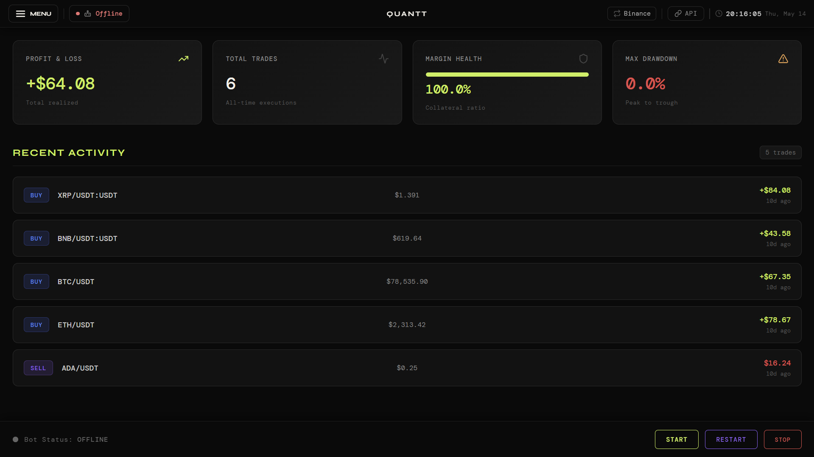
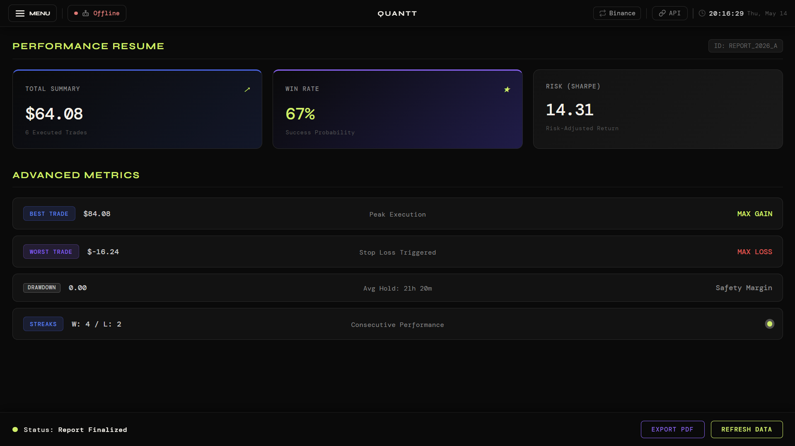

# Quantt

> Local-first algorithmic cryptocurrency trading platform focused on execution, analytics, and extensibility.


---

# Overview

Quantt is a modular cryptocurrency trading platform designed for local execution, strategy experimentation, and advanced market analysis.

The project combines:

* Multi-exchange trading via CCXT
* Technical analysis pipelines
* AI-assisted forecasting
* Custom risk management
* Backtesting and simulation tooling
* Local-first architecture with optional future cloud expansion

Quantt prioritizes lightweight execution, transparency, and extensibility while maintaining direct user control over trading operations.

---

# Goals

## Primary Objectives

* Automate cryptocurrency trading workflows
* Improve operational consistency and execution speed
* Provide customizable strategy development
* Support quantitative experimentation and forecasting
* Maintain local-first execution and data ownership

## Non-Goals

Quantt is **not** intended to:

* Replace user trading decisions entirely
* Provide financial advice
* Manage user finances beyond broker interaction
* Operate as a custodial platform

---

# Target Users

* Algorithmic trading enthusiasts
* Quantitative traders
* Developers experimenting with market automation
* Companies evaluating engineering or quantitative talent

---

# Current Development Roadmap

| Version | Milestone                     | Status                  |
| ------- | ----------------------------- | ----------------------- |
| v0.1    | Execution engine (local-only) | Complete                |
| v0.2    | Backtesting integration       | Planned                 |
| v0.3    | AI forecasting layer          | Planned                 |
| v0.4    | Optional cloud backend        | Experimental / Possible |
| v1.0    | Stable public release         | Future                  |

---

# Core Features

## Trading Engine

* Real-time order execution
* Exchange integration through CCXT
* Order lifecycle management
* Market condition monitoring
* Custom strategy execution

## Analytics

* Technical indicators
* Market signal generation
* Performance metrics
* Graphical analytics
* Trade evaluation

## AI Forecasting

* Time-series forecasting models
* OHLCV-based predictions
* Indicator-aware inference
* Lightweight inference pipeline
* CPU-friendly execution

## Risk Management

* Configurable risk parameters
* Position sizing logic
* Exposure limitation
* Strategy-specific safeguards

## Local-First Architecture

* Fully local execution
* Local API key storage
* No custody of user funds
* Reduced external dependencies

---

# Supported Exchanges

Current and planned integrations through CCXT:

* Binance
* Bybit
* OKX
* MEXC

---

# Tech Stack

## Languages

* Python
* TypeScript
* JavaScript

## Frontend

* React
* Vite
* Electron

## Backend / Engine

* FastAPI
* SQLAlchemy
* CCXT
* loguru

## Quantitative & AI Stack

* PyTorch
* vectorbt
* Pandas
* NumPy
* empyrical

---

# Architecture

```text
┌─────────────────────────────┐
│  Electron + React Frontend │
└──────────────┬──────────────┘
               │
               ▼
┌─────────────────────────────┐
│          FastAPI           │
└──────────────┬──────────────┘
               │
               ▼
┌─────────────────────────────┐
│    Trading Engine Core     │
│      (OOP Structured)      │
└──────────────┬──────────────┘
               │
               ▼
┌─────────────────────────────┐
│     CCXT Exchange Layer    │
└──────────────┬──────────────┘
               │
               ▼
┌─────────────────────────────┐
│          Database          │
└─────────────────────────────┘
```

---

# AI Forecasting Layer

## Model

* Granite TTM 2.1 (fine-tuned)

## Forecast Inputs

* OHLCV market data
* Active technical indicators
* Market condition metrics

## Precision Modes

* FP64
* FP32

## Performance Goals

* Lightweight execution
* Minimal CPU overhead
* Usable on low-end systems
* Designed for 2-core CPUs

---

# Installation

## Requirements

| Component | Requirement             |
| --------- | ----------------------- |
| CPU       | 2 cores minimum         |
| RAM       | 2 GB recommended        |
| Storage   | ~200 MB                 |
| Python    | 3.11+                   |
| Node.js   | 25+                     |
| OS        | Linux / Windows / macOS |

---

# Quick Start

## Clone Repository

```bash
git clone <repo>
cd quantt
```

---

## Engine Setup

```bash
cd quantt-engine

py -m venv venv

# Linux / macOS
source venv/bin/activate

# Windows
venv\Scripts\activate

pip install .

py main.py
```

---

## UI Setup

```bash
cd quantt-ui

npm install

npm run electron
npm run vite
```

---

# Environment Variables

```env
API_BINANCE=
API_SECRET_BINANCE=

API_BYBIT=
API_SECRET_BYBIT=

API_OKX=
API_SECRET_OKX=

API_MEXC=
API_SECRET_MEXC=
```

---

# Configuration

## Configuration Directory

```text
Engine/config
```

## Notes

* Contains exchange-related settings
* Stores local configuration values
* May contain sensitive API-related information

---

# Usage

## Input

User-defined strategy and execution configurations via UI.

## Output

* Performance metrics
* Strategy analytics
* Risk information
* Trading statistics
* Graphical reports

---

# API

## Default Ports

| Service | Port |
| ------- | ---- |
| Engine  | 8000 |
| UI      | 5173 |

## Endpoints

Defined in:

```text
Engine/main.py
Ui/
```

---

# Trading Modes

## Backtesting

* Executed via UI
* Powered by vectorbt
* Historical strategy evaluation

## Paper Trading

* Demo-mode execution
* No real funds involved
* Supported exchanges:

  * Binance
  * Bybit

## Live Trading

Requires:

* Exchange API credentials
* Proper configuration
* User responsibility

---

# Project Structure

```text
quantt/
├── quantt-engine/
│   ├── Engine/
│   ├── config/
│   ├── qdata/
│   ├── logs/
│   └── reporting_portifolio/
│
├── quantt-ui/
│   ├── src/
│   ├── public/
│   └── electron/
│
└── README.md
```

---

# Security

## Important Notes

* API keys are stored locally
* Quantt does not custody user funds
* Users are responsible for securing credentials
* No trading occurs without proper API configuration

## Safety Defaults

* Demo mode recommended by default
* Explicit API configuration required
* Local-first execution model

---

# Limitations

* Primarily designed for local execution
* Limited horizontal scalability
* Single-exchange session support (current)
* AI forecasting still experimental

---

# Contributing

## Contribution Rules

* Contributions only through GitHub pull requests
* Large architectural changes may have lower acceptance probability
* Ensure proper testing before submission

## Code Style

### Naming Conventions

```python
snake_case
SCREAMING_SNAKE_CASE
```

### Formatting

* 4-space indentation
* Structured OOP organization
* Modular component separation

---

# Screenshots

## Home



## Resume / Analytics



---

# Disclaimer

Quantt is an experimental trading platform.

This software does **not** provide financial advice. Cryptocurrency trading involves substantial risk, including the possibility of capital loss.

Users are solely responsible for:

* Trading decisions
* API credential management
* Risk management
* Financial outcomes resulting from usage

---

# License

MIT License

---

# Maintainer

* THI100 (solo project)
